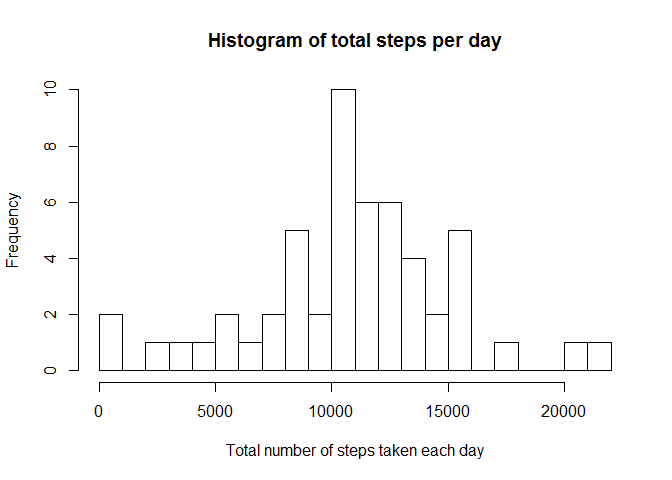
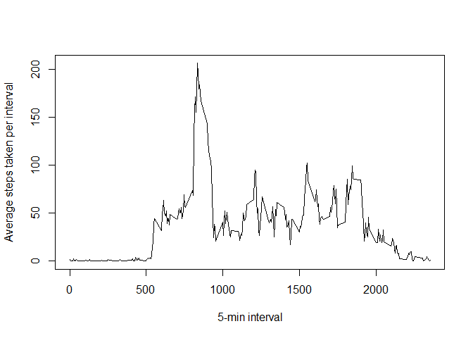
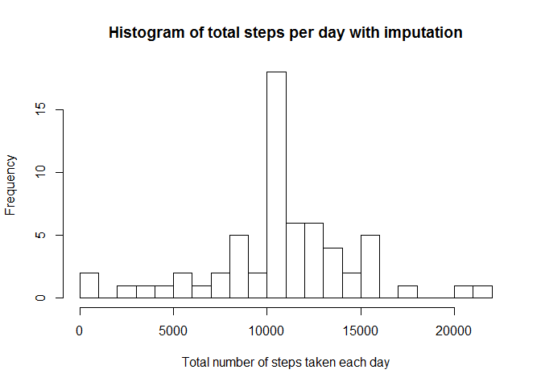
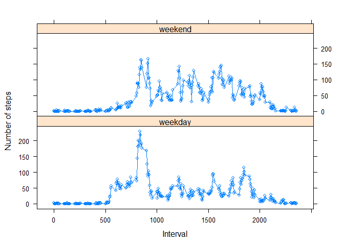

# Reproducible Research: Peer Assessment 1
Shuguang Ji  
January 10, 2016  
##Introduction
It is now possible to collect a large amount of data about personal movement using activity monitoring devices such as a Fitbit, Nike Fuelband, or Jawbone Up. These type of devices are part of the "quantified self" movement - a group of enthusiasts who take measurements about themselves regularly to improve their health, to find patterns in their behavior, or because they are tech geeks. But these data remain under-utilized both because the raw data are hard to obtain and there is a lack of statistical methods and software for processing and interpreting the data.

This assignment makes use of data from a personal activity monitoring device. This device collects data at 5 minute intervals through out the day. The data consists of two months of data from an anonymous individual collected during the months of October and November, 2012 and include the number of steps taken in 5 minute intervals each day.

##Data
The data for this assignment can be downloaded from the course web site:

The variables included in this dataset are:

**steps**: Number of steps taking in a 5-minute interval (missing values are coded as NA)  
**date**: The date on which the measurement was taken in YYYY-MM-DD format  
**interval**: Identifier for the 5-minute interval in which measurement was taken  

The dataset is stored in a comma-separated-value (CSV) file and there are a total of 17,568 observations in this dataset.

## Install packages


```r
install.packages("dplyr", repos = 'http://cran.us.r-project.org')
library(dplyr)

if (!require('lattice')) 
{
  install.packages('lattice');
  library(lattice);
}
```

## Loading and preprocessing the data
Download the data and save it under the working directory. Then unzip dataset using *unzip("activity.zip")* and read the data from "activity.csv"


```r
data<-read.csv("activity.csv",  sep = ",", header = TRUE, stringsAsFactors = FALSE)
```

Then check out the first 6 rows of dataset.


```r
head(data)
```

```
##   steps       date interval
## 1    NA 2012-10-01        0
## 2    NA 2012-10-01        5
## 3    NA 2012-10-01       10
## 4    NA 2012-10-01       15
## 5    NA 2012-10-01       20
## 6    NA 2012-10-01       25
```

To me, the dataset looks good. I didn't do any process or transform.

## What is mean total number of steps taken per day?
First, I calculated the total number of steps taken per day.


```r
agg.data.no.na<-aggregate(steps~date,data,sum,na.rm=T)
```

Then the histogram of the total number of steps taken each day is created.


```r
hist(agg.data.no.na$steps,breaks=16, xlab = "Total number of steps taken each day", main = "Histogram of total steps per day")
```

 
Then the mean and median of the total number of steps taken per day are reported. 


```r
avg.step.no.na<-round(mean(agg.data.no.na$steps))
med.step.no.na<-round(median(agg.data.no.na$steps))
print(c("The mean is", avg.step.no.na),quote = F)
```

```
## [1] The mean is 10766
```

```r
print(c("The median is", med.step.no.na), quote = F)
```

```
## [1] The median is 10765
```

## What is the average daily activity pattern?
First, we need to group the data by intervals.


```r
agg.interval.no.na<- aggregate(steps ~ interval, data, mean, na.rm = T)
```

Then, make a time series plot (i.e. type = "l") of the 5-minute interval (x-axis) and the average number of steps taken, averaged across all days (y-axis).


```r
with(agg.interval.no.na, {
  plot(steps~interval, type = "l", ylab = "Average steps taken per interval", xlab = "5-min interval")
})
```

 

We are also interested in which 5-minute interval, on average across all the days in the dataset, contains the maximum number of steps.


```r
max.step<-round(max(agg.interval.no.na$steps))
max.step.interval<-agg.interval.no.na[which.max(agg.interval.no.na$steps),"interval"]
print(c("The max number of interval steps is", max.step), quote = F)
```

```
## [1] The max number of interval steps is 206
```

```r
print(c("The 5-min interval that contains the max number of steps is",max.step.interval), quote = F)
```

```
## [1] The 5-min interval that contains the max number of steps is
## [2] 835
```

## Imputing missing values
Calculate and report the total number of missing values in the dataset (i.e. the total number of rows with NAs).


```r
missing.rows<-sum(!complete.cases(data))
print(c("The number of missing values in the dataset is",missing.rows),quote = F)
```

```
## [1] The number of missing values in the dataset is
## [2] 2304
```

Devise a strategy for filling in all of the missing values in the dataset with the mean for that 5-minute interval. And create a new dataset that is equal to the original dataset but with the missing data filled in.


```r
newdata<-data  # new dataset without NAs
interval<-tapply(data$steps, data$interval, mean, na.rm=T)
for (i in 1:nrow(data)){
  if(is.na(data$steps[i])){
     newdata$steps[i]<- interval[[as.character(data[i, "interval"])]]
  }
}
```

Make a histogram of the total number of steps taken each day. 


```r
agg.data.imp<-tapply(newdata$steps, newdata$date, sum)
hist(agg.data.imp,breaks=16, xlab = "Total number of steps taken each day", main = "Histogram of total steps per day with imputation")
```

 

Report the mean and median total number of steps taken per day.

```r
avg.step.imp<-round(mean(agg.data.imp))
med.step.imp<-round(median(agg.data.imp))
print(c("The mean is", avg.step.imp),quote = F)
```

```
## [1] The mean is 10766
```

```r
print(c("The median is", med.step.imp), quote = F)
```

```
## [1] The median is 10766
```

These values are similar as the estimates from the first part of the assignment. By replacing the missing values with the mean values, the impact of imputing missing data on the estimates of the total daily number of steps is ignorable. 

## Are there differences in activity patterns between weekdays and weekends?
First, create a new factor variable in the dataset with two levels - "weekday" and "weekend" indicating whether a given date is a weekday or weekend day.


```r
weekdays.sgn<-weekdays(as.Date(newdata$date))
newdata$day.type<-sapply(weekdays.sgn, function(sgn) {
  if (sgn %in% c("Saturday", "Sunday")) {
    return("weekend")
  } else {
    return("weekday")
  }
})
```

Make a panel plot containing a time series plot of the 5-minute interval (x-axis) and the average number of steps taken, averaged across all weekday days or weekend days (y-axis).


```r
agg.newdata <- newdata %>% group_by(interval, day.type) %>% summarise(avg.step = mean(steps))

xyplot(avg.step ~ interval | day.type, data = agg.newdata, type = "b",layout = c(1, 2), ylab = "Number of steps", xlab = "Interval")
```

 
